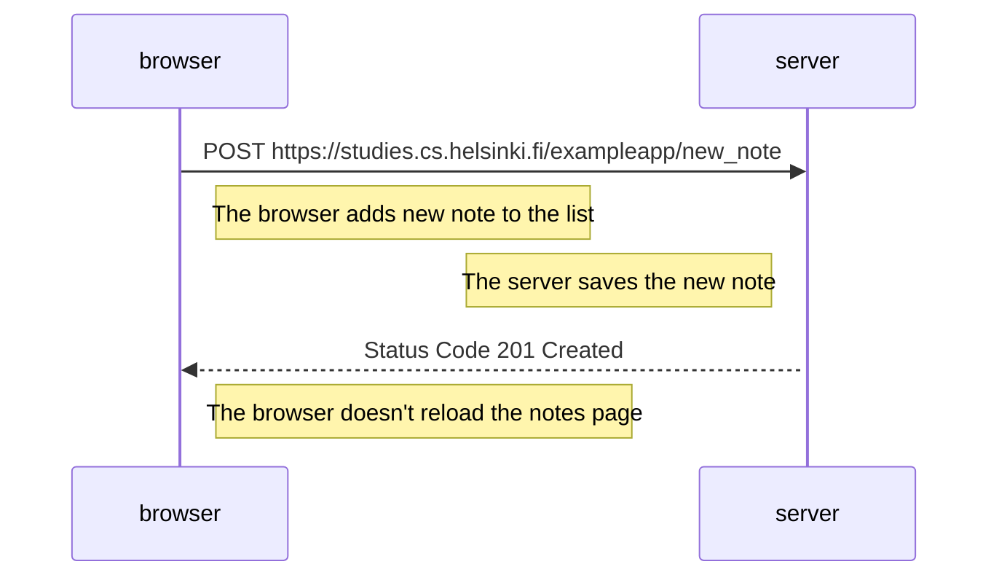

```mermaid
sequenceDiagram
    participant browser
    participant server

    browser->>server: POST https://studies.cs.helsinki.fi/exampleapp/new_note
    activate server

    Note right of browser: The browser adds new note to the list

    Note left of server: The server saves the new note

    server-->>browser: Status Code 201 Created
    activate server

    Note right of browser: The browser doesn't reload the notes page
```